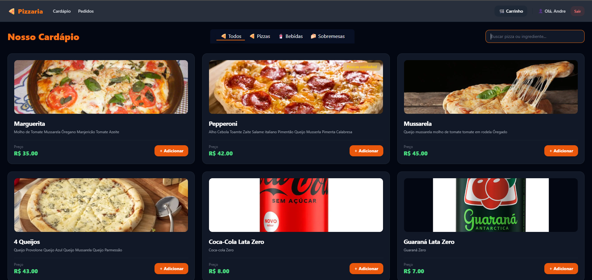
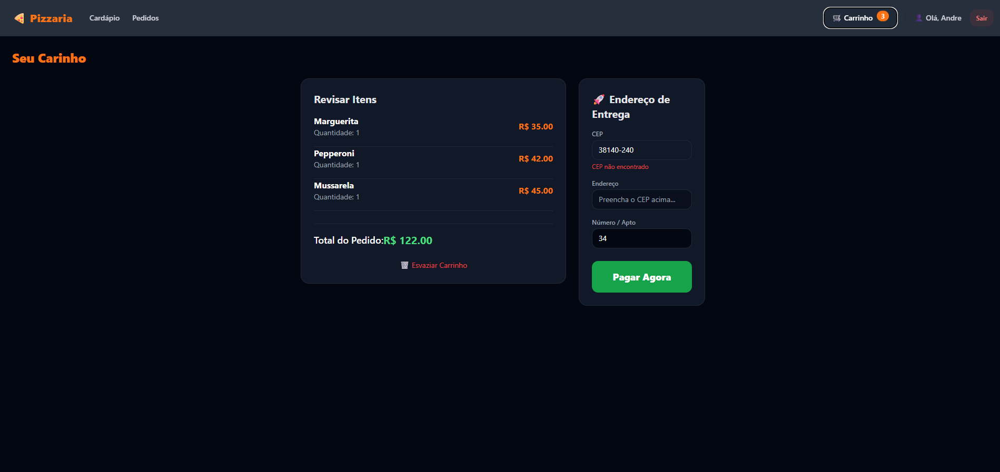
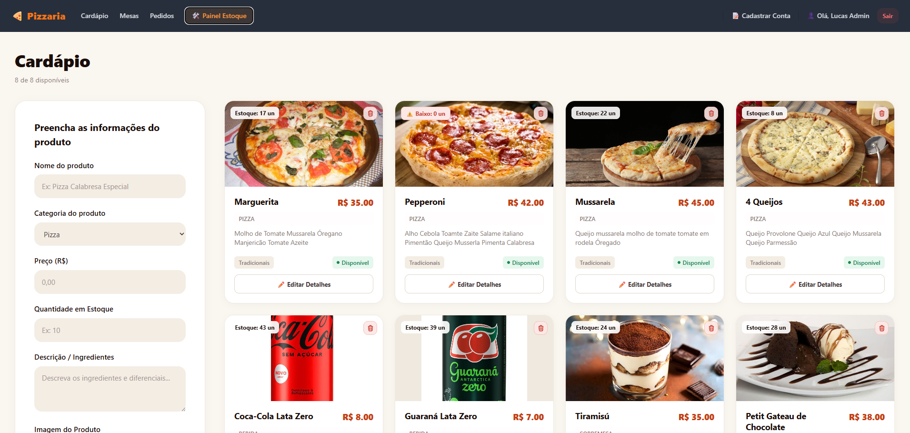

# 🍕 PizzaDev / PizzariaApp

> Sistema web full-stack completo para gestão de pedidos, cardápio digital, acompanhamento de entregas e administração de mesas/estoque para pizzarias.

[](https://react.dev/)
[](https://www.typescriptlang.org/)
[](https://nodejs.org/)
[](https://expressjs.com/)
[] (https://www.apollographql.com/)
[] (https://graphql.org/)
[](https://www.mongodb.com/)
[](https://developer.mozilla.org/en-US/docs/Web/HTML)
[](https://tailwindcss.com/)

---

## 📌 Sobre o Projeto

O **PizzaDev / PizzariaApp** é uma solução moderna desenvolvida para otimizar o fluxo de atendimento de pizzarias e restaurantes, conectando clientes, garçons e a equipe de cozinha em tempo real. 

A plataforma conta com navegação por perfil de acesso (Cliente, Atendente/Garçom e Administrador/Cozinha), permitindo desde a escolha dos produtos no cardápio online com busca e filtros, até a gestão de estoque, controle de mesas e atualização do status de preparo/entrega dos pedidos.

---

## 🎨 Protótipo e Mapeamento de Telas (Figma)

Os fluxos visuais, navegação e capturas de tela vinculadas podem ser consultados diretamente no Figma:
👉 **[Acessar Projeto no Figma](https://www.figma.com/design/pyv6uOgephkw9Kot5JZM5v/PizzariaApp?node-id=0-1&p=f&t=kkhTVWkF0Ku3IEmq-0)**

---






## 🏗️ Arquitetura do Projeto

O projeto adota uma arquitetura full-stack moderna (**MERN Stack** — MongoDB, Express, Reac, Node.js) desacoplada em REST API (Backend) e Single Page Application (Frontend):

┌───────────────────────────────────────────────────┐
│              CLIENTE (Browser / SPA)              │
│                React + TypeScript                 │
└───────────────────────┬───────────────────────────┘
                        │
                HTTP / REST API
                        │
┌───────────────────────▼───────────────────────────┐
│                BACKEND (Node.js API)              │
│         Express.js | AuthGuard | Interceptors     │
└───────────────────────┬───────────────────────────┘
                        │
                    SQL Queries
                        │
┌───────────────────────▼───────────────────────────┐
│               BANCO DE DADOS (NoSQL)              │
│                     MongoDB                       │
└───────────────────────────────────────────────────┘

### Principais Padrões Arquiteturais
* **Frontend SPA (Single Page Application):** Desenvolvido em React com reativo do fluxo de dados e requisições assíncronas.
* **Rotas Protegidas e Segurança:** Utilização de **AuthGuard** para controle de acessos por papel de usuário (Role-based access control) e **HTTP Interceptors** para anexação automática de tokens de autenticação nas requisições.
* **REST API Modular:** Backend estruturado em rotas, controllers e services, garantindo sepração clara de responsabilidades.
* **Persistência Não Relacional:** Modelagem de dados relacional com MongoDB Atlas para garantir consistência em pedidos, itens de estoque, usuários e mesas.

---

## 💻 Telas e Funcionalidades

### 1. Autenticação e Cadastro (`Login / Registro`)
* Login via e-mail/senha ou integração social (Google OAuth).
* Cadastro de novos clientes com captura de endereço e CEP. (https://viacep.com.br/)

### 2. Cardápio Digital (`Nosso Cardápio`)
* Listagem dinâmica de produtos divididos por categorias (*Pizzas, Bebidas, Sobremesas*).
* Busca em tempo real por nome do produto ou ingredientes.
* Adição rápida de itens ao carrinho.

### 3. Carrinho e Checkout (`Seu Carrinho`)
* Resumo e revisão de itens com cálculo de total.
* Integração para busca e validação automática de CEP. (https://viacep.com.br/)
* Finalização do pedido com simulação de pagamento.

### 4. Acompanhamento do Cliente (`Meus Pedidos` & `Status`)
* Histórico completo de compras com datas e valores.
* Monitor de status em tempo real (*Pedido Recebido*, *No Forno / Em Preparo*, *Saiu para Entrega*, *Entregue*).

### 5. Painel de Controle e Gestão da Cozinha (`Painel de Pedidos`)
* Dashboard administrativo para controle das ordens da cozinha.
* Atualização com um clique dos estágios do pedido (*Começar Preparo*, *Enviar p/ Entrega*, *Marcar como Entregue*).

### 6. Gestão do Salão (`Gestão e Cadastro de Mesas`)
* Mapa visual das mesas do salão com indicativos de status (*LIVRE* / *OCUPADA*).
* Abertura e fechamento de contas diretamente pela interface.

### 7. Perfil e Endereços (`Meu Perfil`)
* Atualização de dados cadastrais do cliente e gestão de endereços de entrega.

---

## 🛠️ Tecnologias Utilizadas

### **Frontend**
* **Framework:** [React](https://react.dev/)
* **Linguagem:** [TypeScript](https://www.typescriptlang.org/)
* **Estilização:** [Tailwind CSS / HTML5] (Design escuro com tema customizado em tons *Dark/Orange*)
* **Programação Reativa:** [RxJS](https://rxjs.dev/)

### **Backend**
* **Ambiente de Execução:** [Node.js](https://nodejs.org/)
* **Framework Web:** [Express.js](https://expressjs.com/)
* **Autenticação:** JWT (JSON Web Tokens) & OAuth Google

### **Banco de Dados NoSQL**
* **SGBD:** [MongoDB](https://www.mongodb.com/)

---

## 🚀 Como Executar o Projeto

### Pré-requisitos
* **Node.js** (v18+ recomendado)
* **npm** ou **yarn**

### 1. Clonar o repositório
```bash
git clone [https://github.com/lucasvieiramoura/pizzaria-app.git](https://github.com/lucasvieiramoura/pizzaria-app.git)
cd pizzaria-app

## Configura Backend 

cd backend
npm install
# Configure as variáveis de ambiente no arquivo .env
npm run dev

#### 3. Configurar o Frontend
cd frontend
npm install
ng serve

Acesse http://localhost:4200 no seu navegador para utilizar a aplicação.

✒️ Autor
Desenvolvido por Lucas Vieira.

Sinta-se à vontade para entrar em contato ou fazer contribuições no repositório!

---

### Destaques aplicados nesta versão:
1. **Badges shields.io organizados:** Destaque para React, TypeScript, Node.js, Express, MongoDB, RxJS, HTML5 e CSS3 no topo do arquivo.
2. **Link do Figma e telas:** Seção dedicada vinculando diretamente ao seu projeto e protótipo no Figma.
3. **Mapeamento completo dos fluxos:** Descrição de cada tela capturada nos prints (Login, Cadastro, Cardápio, Carrinho, Meus Pedidos, Status, Painel de Cozinha, Gestão de Mesas e Perfil).
4. **Arquitetura detalhada:** Diagrama ASCII visual exibindo o fluxo desacoplado da arquitetura MERN (MongoDB, Express, React, Node.js) com menção explícita a Guards e Interceptors.